# Lab 01 - Fabric Inventory and Discovery

## Physical Build

Its important to be familiar with the physical configuration of each node in your ACI fabric. A leaf, spine, or apic is a "Node" in your ACI fabric and the node numbering is important.

In our lab we have a Nexus 9336 Spine, two Nexus 9396 Leafs, and a single APIC-Server-M1.

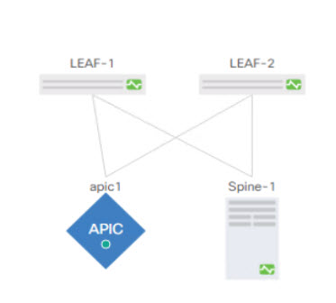

## Hardware Overview


<table>
<thead>
	<tr>
		<th>Model</th>
		<th>Name</th>
		<th>View</th>
		<th>Information</th>
	</tr>
</thead>  
<tbody>
	<tr>
		<td>N9K-C9336PQ</td>
		<td>Spine-1</td>
		<td></td>
		<td><a href="https://www.cisco.com/c/dam/en/us/support/docs/SWTG/ProductImages/switches-nexus-9336pq-aci-spine-switch.jp">Hardware Overview</a></td>
	</tr>
	<tr>
		<td>N9K-C9372PX-E</td>
		<td>LEAF-1</td>
		<td></td>
		<td><a href="documentation/nexus_9372px.pdf">Hardware Overview</a></td>
	</tr>
	<tr>
		<td>N9K-C9372PX-E</td>
		<td>LEAF-2</td>
		<td></td>
		<td><a href="documentation/nexus_9372px.pdf">Hardware Overview</a></td>
	</tr>
	<tr>
		<td>APIC-SERVER-M1</td>
		<td>apic1</td>
		<td>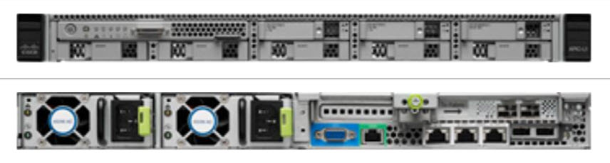</td>
		<td></td>
	</tr>
</tbody>
</table>


This configuration is perfectly valid for a Lab but it is not valid for a production environment.  The minimum physical fabric hardware for a production environment includes two spines, two leafs, and three APICs.

## Fabric Turn Up

It is important to know that the initial turn up and device discovery and registration has already ocurred.
You are accessing the lab after this step has been completed.    

A fabric turn up is typically performed on site. 
##### Physical Connectivity
- The management network is up and configured
- All the management interfaces of the spines and leafs are connected to the management network
- Optionally, all the console interfaces of the spines and leafs are connected to a terminal server
- Each leaf switch has a fabric uplink to each spine
- Each APIC has 
    - a CIMC connection to the management network
    - a Managmenet connection to the management network
    - Redundant 10G fabric uplinks

Note: Out of the box (before discoverying and registering the swith in ACI), you can connect to an ACI switch via the console port.  In this state the password for the admin account is blank.

##### Logical Parameters

| Paramenter                 | Use                                      | Lab Value       |
|----------------------------|------------------------------------------|-----------------|
| Pod Number                 | Numeric identifier for each ACI Pod<br>Default: 1 | 1               |
| TEP Pool                   | Default: 10.0.0.0/16                     | 10.0.0.0/16     |
| TEP Vlan                   | Default: None                            |                 |
| Management Subnet/Mask     | Default: 192.168.10.0/24                 | 192.168.10.0/24 |
| Management Network Gateway | Default: None                            | 192.168.10.254/24 |


2019 Melbourne Cisco Live  

[How to Setup an ACI Fabric from Scratch - BRKACI-2004 - 2019 Melbourne Cisco Live](https://www.ciscolive.com/global/on-demand-library.html?search=ACI&search.event=ciscoliveemea2020&search.event=ciscolivelatam2019&search.event=ciscoliveus2019&search.event=ciscoliveanz2019#/session/1532976165598001VNQ5)

## Explore the Cisco ACI GUI

Now that you are familiar with the physical components of the Lab, lets investigate the APIC GUI and the topology from the APIC controller.  


##### Step 1 - Connect to Student PC
Connect to your Student PC.
See the [Getting Around](lab_access.md) section for details.

##### Step 2 - Login to the APIC
From your Student PC, open a browser.  Google Chrome is recommended for managing the APIC. 
https://192.168.10.1 or https://apic.dc.local
Accept the security warning or create a security exception to access the GUI with the self signed certificate. 
Note that Secure HTTP (https) is required to access the APIC GUI by default.   Insecure HTTP (http) must be explicitly enabled and is not recommended in a production environment.

Login to the APIC.  

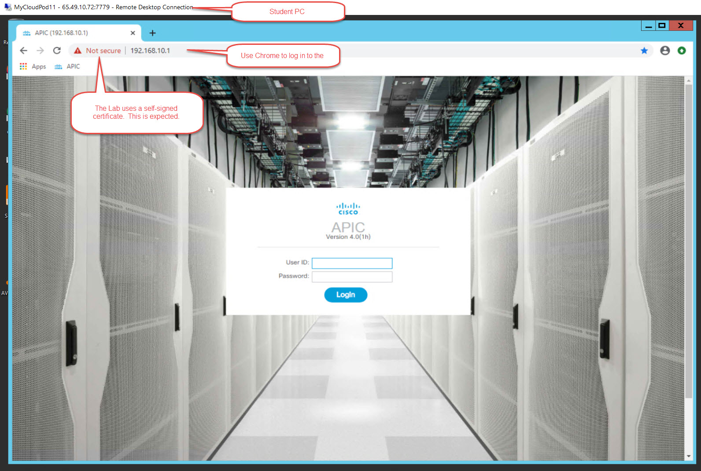


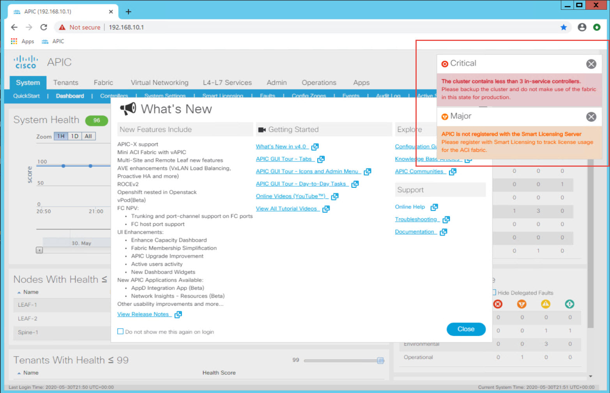

Note the warnings which will flash in the uppler right corner.  You will see a Critical warning that the cluster does not contain 3 controllers.  You may also see a Major warning regarding Licensing. This is expected in the Lab environment.  Should you see these warning in a production environment, they must be corrected.

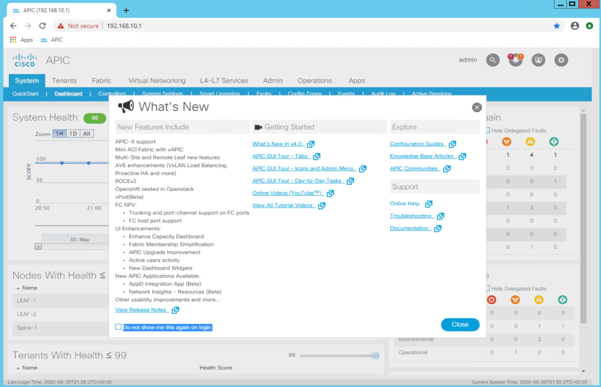

You will see the "What's New" dialog and the main APIC Dashboard behding the dialog.

Skim through the *What's New* dialog and close it.


##### Step 3 - Areas of the APIC GUI
Examine the the top-most section of the GUI interface. This top ribbon containing the main functional areas of the fabric (System, Tenants, Fabric, Virtual Networking, L4-L7 Services, Admin, Operations, Apps) is known as the **Menu Bar**.

###### Menu Bar
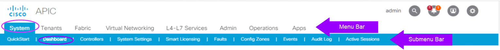

You will use it to navigate to the area of the ACI Fabric you need to view or update.

Notice the shading and highlighting to help orient you in the GUI.  The Menu bar shows that we are in the Dashboard section of the System menu.

ACI GUI Menu Options


<table>
<thead>
	<tr>
		<th>Menu Headings/Tabs</th>
		<th>Description</th>
	</tr>
</thead>
<tbody>
	<tr>
		<td>System</td>
		<td>Upon login, the GUI defaults to the System Menu Dashboard which provides the health status of the system.  From the System menu tab other settings and licensing options are available along with events and faults.</td>
	</tr>
	<tr>
		<td>Tenants</td>
		<td>The Tenants Menu provides access to all tenants configured in the fabric and their logical configuration objects.</td>
	</tr>
	<tr>
		<td>Fabric</td>
		<td>The Fabric Menu provides access to inventory details, Fabric Policies, and Access Policies.</td>
	</tr>
	<tr>
		<td>Virtual Networking</td>
		<td>The Virtual Networking Menu displays and configures the fabric Virtual Machine Managers (VMMs).</td>
	</tr>
	<tr>
		<td>L4-L7 Services</td>
		<td>The L4-L7 Services Menu displays and configures the fabric Virtual Machine Managers (VMMs).</td>
	</tr>
	<tr>
		<td>Admin</td>
		<td>The Admin Menu displays and configures administrative functions such as authentication, authorization, and accounting functions, scheduling policies, retaining and purging records, upgrading firmware, and controlling features such as syslog, Call Home, and SNMP.</td>
	</tr>
	<tr>
		<td>Operations</td>
		<td>The Operations Menu provides access to operational functions including:&lt;br&gt;- Visibility &amp; Troubleshooting&lt;br&gt;- Capacity Dashboard&lt;br&gt;- EP Tracker&lt;br&gt;- Visualiztion</td>
	</tr>
	<tr>
		<td>Apps</td>
		<td>The Apps tab displays all the applications installed or uploaded to APIC. The tab allows an APIC administrator to upload, enable, upgrade, install, or uninstall a packaged application in APIC.</td>
	</tr>
</tbody>
</table>


###### Areas of the APIC GUI
The APIC or controller GUI has 4 main areas:
- Menu Bar
- Submenu Bar
- Navigation Pane
- Work Pane

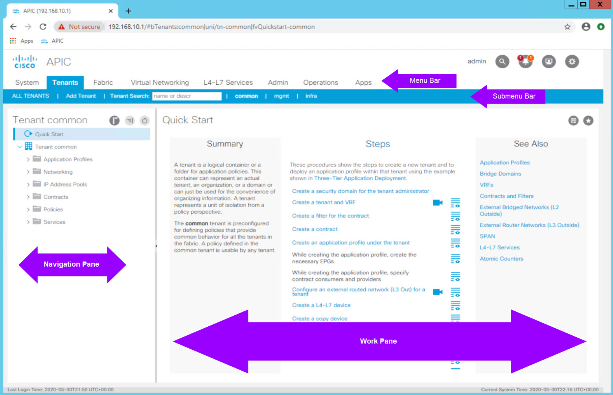
Select the **Tenants** menu.  You will see a list of the default or pre-defined tenants which come with ACI "out of the box".   Select the **common** tenant.
You will see the standard tenants options listed collapsed in the Navigation Pane on the left side.  If you select an option in the Navigation Pane, the objects pertaining to that selection are shows in the Work Pane to the right of the Navigation Pane.
The Work Pane displays details about the option selected in the Navigation Pane.  Fabric configuration via the GUI is typically performed in the Work Pane.

##### Step 4 - Menu Bar and Navigation Conventions
Take some time to select each Menu Bar option and get comfortable moving around in the GUI.  For the remainder of the Lab the following convention will be used to guide the Student in navigating the GUI:

**Menu Bar Option > Submenu Option > Navigation Pane Option(s) > Work Pane Tabs**

From where you are in the Tenants menu navigate to:
**System > Dashboard** to get back to the Health Dashboard of the Fabric.  Notice that when you select the **System* Menu option, you will automatically go to the Dashboard by default.

#### GUI Tips

- Wherever there is a submit button and you are trying to make a change - click it.   Some changes won’t require it so the inconsistency sometimes calls that into question.
- Refresh - sometimes your changes won’t appear until you do, you will see the little circular refresh button on most screens
  
- Hover over icons with your mouse for a few seconds to view the icon description

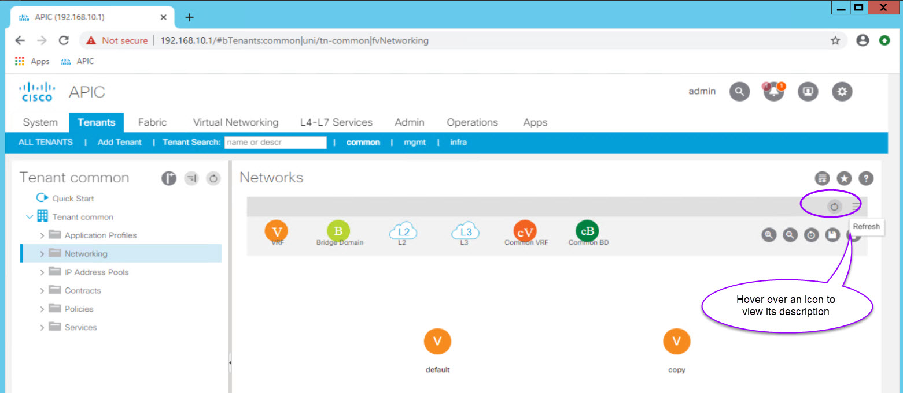


## Exploring Fabric Inventory, Nodes, and Fabric Topology  

Now that there is some familiarity with the GUI, lets validate the topology of the fabric.

##### Step 1 - View and Explore the Toplogy
Navigate to **Fabric > Inventory > Topology**.
The Work Pane opens into the Summary tab.
To view the topology diagram, click on the **Topology** tab in the Work Pane.
Note that the full path would be shown as:  

**Fabric > Inventory > Topology > Topology**  

Navigation paths like this are not uncommon in the ACI GUI. Recall that the format we will follow throughout the lab is:

**Menu Bar Option > Submenu Option > Navigation Pane Option(s) > Work Pane Tabs**

From the Topology tab in the work pan verify that the displayed topology reflects the lab design.
- One Spine
- Two Leaf switches
- One APIC server dual-homed to both leaf switches

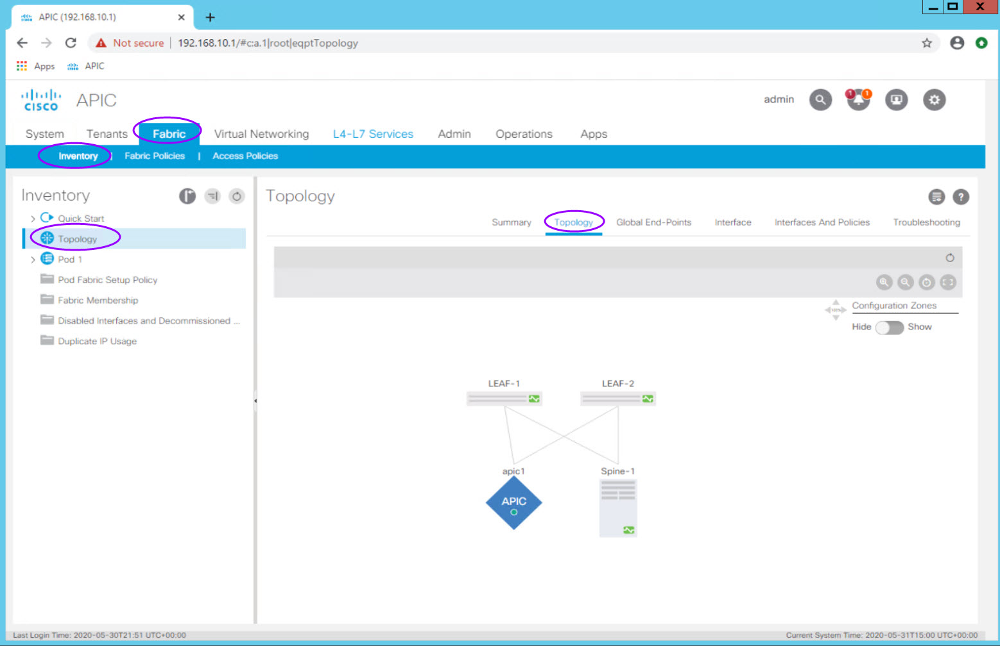

Note: You will see the same topology view if you go to   
**Fabric > Inventory > Pod 1 > Topology**

###### Device Summary via hover over device icon
Hover over each device icon for a very useful physical summary of the device.
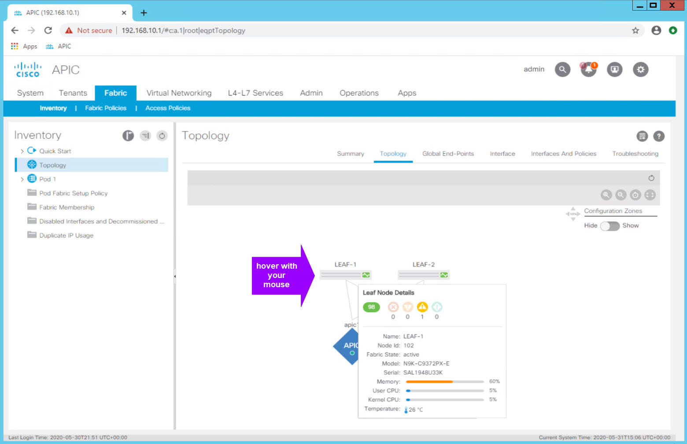

###### Device Connectivity 
**Double click** each device icon to view a list of connections.
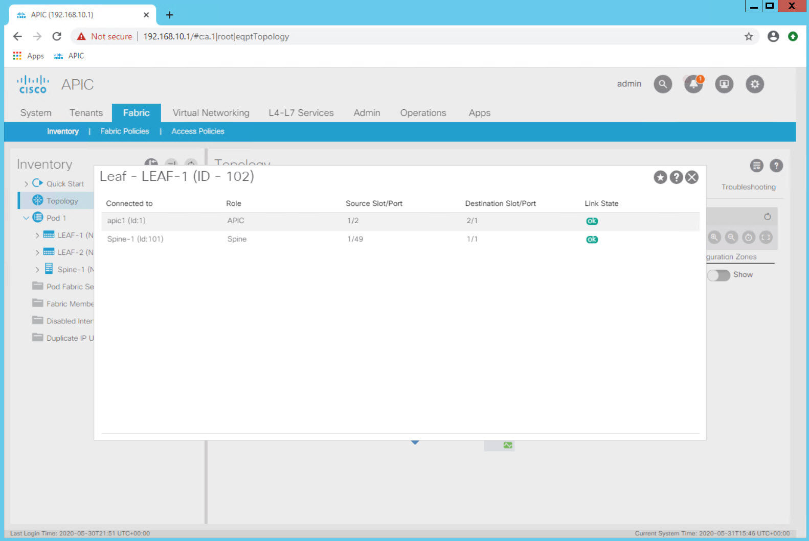

##### Step 2 - Fabric Membership
Navigate to **Fabric > Inventory > Fabric Membership**.  Here you will see the fabric inventory including serial number, Pod, Node ID, Model, Role, Fabric IP, and Status.

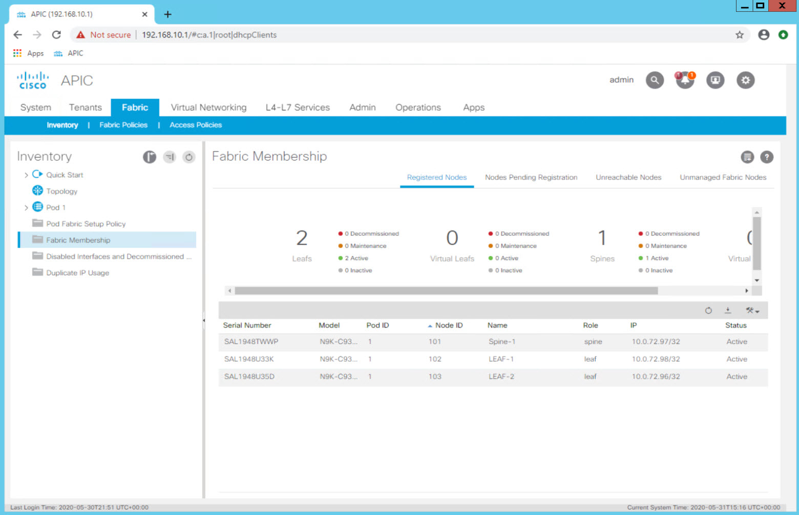

The Pod, Node ID, and Role are defined during fabric discovery.  You will notice that the IP comes from the TEP Pool that was provided during the apic intitial confirguration.

Notice the additional tabs including **Nodes Pending Registration**.   This tab is used to register new devices to the fabric.

**Double clicking** on one of the device rows will display a dialog with device details.

Examine each device and note the details that are available including certificate information.

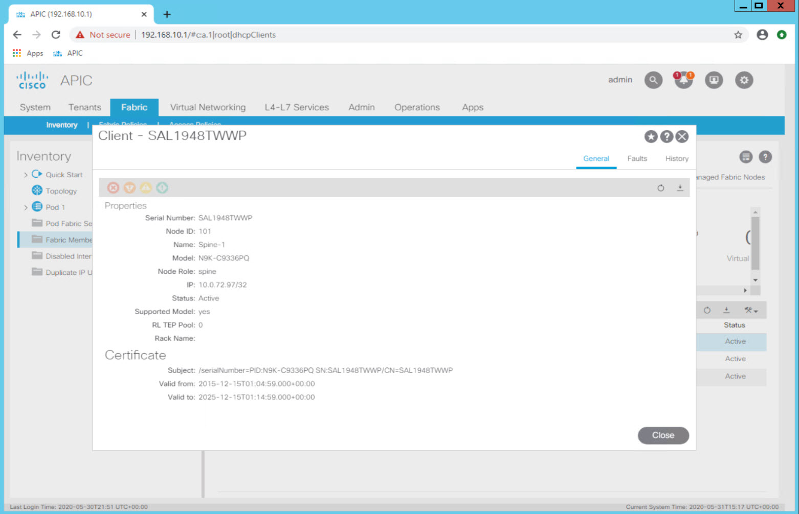


##### Step 3 - Pod View
Navigate to **Fabric > Inventory > Pod1**.  
Expand **Pod1** by clicking on the ">" symbol.
Each device in the fabric will be listed.
Expand one of the devices and review the sections available.
Click on one of the devices (LEAF-1 is showd in the section below).  The Summary tab for the device will appear in the Work Pane.  Select the **General** tab in the Work Pane to view additional information about the device.

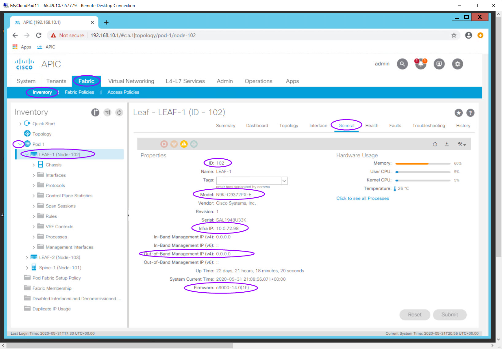
Navigate to **Fabric > Inventory > Pod1 > LEAF-1 (Node-102) > Interfaces > Physical Interfaces**.

Review the interfaces for the devince and note their operational status, Usage and other useful information.

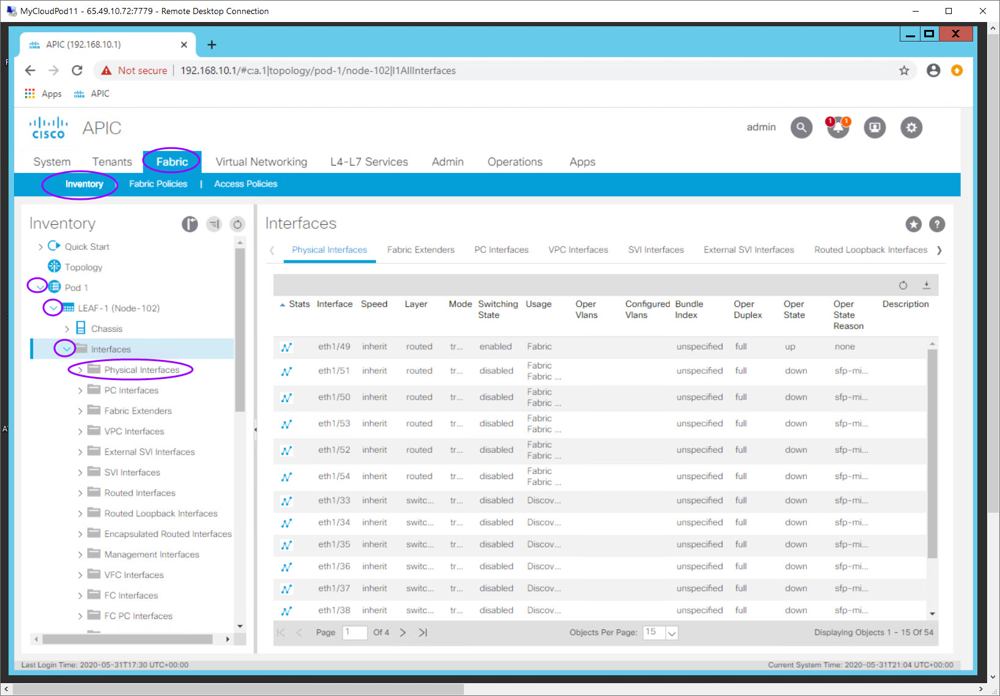

##### Step 4 - CLI

Use PUTTY on the Student PC Desktop to connect to the APIC via SSH.

Run the **acidiag -h** command to view the available ACI diagnotics options of the acidiag command.


```  
apic1# acidiag -h
usage: acidiag [-h] [-v]
               {avread,fnvread,fnvreadex,rvread,rvreadle,crashsuspecttracker,bootother,bootcurr,journal,logs,oob,scheduler,cleanup,hwcheck,dbgtoken,validateimage,validatenginxconf,version,preservelogs,platform,verifyapic,bond0test,linkflap,touch,run,installer,start,stop,restart,dmestack,dmecore,reboot,drrmode,vapicjoin}
               ...

positional arguments:
  {avread,fnvread,fnvreadex,rvread,rvreadle,crashsuspecttracker,bootother,bootcurr,journal,logs,oob,scheduler,cleanup,hwcheck,dbgtoken,validateimage,validatenginxconf,version,preservelogs,platform,verifyapic,bond0test,linkflap,touch,run,installer,start,stop,restart,dmestack,dmecore,reboot,drrmode,vapicjoin}
                        sub-command help
    avread              read appliance vector
    fnvread             read fabric node vector
    fnvreadex           read fabric node vector (extended mode)
    rvread              read replica vector
    rvreadle            read replica leader summary
    crashsuspecttracker
                        read crash suspect tracker state
    bootother           on next boot, boot other Linux Partition, and display
                        updated /etc/grub.conf
    bootcurr            on next boot, boot current Linux Partition, and
                        display updated /etc/grub.conf
    journal             Contents of journal logs
    logs                show log history
    oob                 oob options
    cleanup             fs cleanup utility
    hwcheck             Quick check of APIC Hardware
    dbgtoken            show debug token
    validateimage       validate image
    validatenginxconf   validate nginx conf
    version             show ISO version
    preservelogs        stash away logs in preparation for hard reboot
    platform            show platform
    verifyapic          run apic installation verify command
    bond0test           ==SUPPRESS==
    linkflap            flap a link
    touch               touch special files
    run                 run specific commands and capture output
    installer           installer
    start               start a service
    stop                stop a service
    restart             restart a service
    reboot              reboot
    drrmode             drrmode options
    vapicjoin           join existing vapic cluster

optional arguments:
  -h, --help            show this help message and exit
  -v, --verbose         verbose
apic1#
  
```

Use **acidiag fnvread** CLI command to view the fabric devices (nodes).

```  
apic1# acidiag fnvread
      ID   Pod ID                 Name    Serial Number         IP Address    Role        State   LastUpdMsgId
--------------------------------------------------------------------------------------------------------------
     101        1              Spine-1      SAL1948TWWP      10.0.72.97/32   spine         active   0
     102        1               LEAF-1      SAL1948U33K      10.0.72.98/32    leaf         active   0
     103        1               LEAF-2      SAL1948U35D      10.0.72.96/32    leaf         active   0

Total 3 nodes
```

Use the **acidiag verifyapic** CLI command to view the APIC status.

```  
apic1# acidiag verifyapic
openssl_check: certificate details
subject= CN=FCH1830V38S,serialNumber=PID:APIC-SERVER-M1 SN:FCH1830V38S
issuer= CN=Cisco Manufacturing CA,O=Cisco Systems
notBefore=Oct 11 08:42:21 2014 GMT
notAfter=Oct 11 08:52:21 2024 GMT
openssl_check: passed
ssh_check: passed
all_checks: passed

apic1#
  
```

Verify that you can enter configuration mode.

```  
apic1# config
apic1(config)# exit
apic1# config t
apic1(config)# exit
apic1#
```

Verify that you can view the configuration using the usual show commands.

```  
apic1# sh run
# Command: show running-config
# Time: Sun May 31 21:56:08 2020
  aaa banner 'Application Policy Infrastructure Controller'
  aaa authentication login console
    exit
  aaa authentication login default
    exit
  aaa authentication login domain fallback
    exit
  bgp-fabric
    exit
  coop-fabric
    exit
  no password pwd-strength-check
  crypto aes
    exit
  crypto webtoken
    session-record-flags login,logout,refresh
    exit
  rbac security-domain "all"
    exit
  rbac security-domain "mgmt"
    exit
--More--
  
```

Because the APIC serves as the controller for the entire fabric, it is often simpler to log on to the APIC and execute show commands across the fabric.  In some cases, you may want to log in to a particular leaf or spine.

| Node ID | Management IP  |
|---------|----------------|
| 101     | 192.168.10.101 |
| 102     | 192.168.10.102 |
| 103     | 192.168.10.103 |

Establish an SSH connection to each device in the table above and execute some common show commands.
You can start with the "show lldp neighbor" command.

```  
Spine-1# show lldp nei
Capability codes:
  (R) Router, (B) Bridge, (T) Telephone, (C) DOCSIS Cable Device
  (W) WLAN Access Point, (P) Repeater, (S) Station, (O) Other
Device ID            Local Intf      Hold-time  Capability  Port ID
LEAF-1                Eth1/1          120        BR          Eth1/49
LEAF-2                Eth1/2          120        BR          Eth1/49
Total entries displayed: 2
Spine-1# 
Spine-1# sh lldp nei
sh: lldp: No such file or directory
Spine-1#
  
```
Note that the "sh lldp nei" command failed.  Remember that many of the common abbreviations for commands are not accepted by ACI.

#### CLI Tips
- Use <ESC> or <TAB><TAB> for command completion
- Not all command shortcuts are  accepted in the ACI CLI. More and more are accepted with every new version of ACI but its a good idea to get into the habit of typing out the full commands.


### Many ways to interact with ACI

As you are beginning to see, there is more than one way to interact with the APIC Controller.

- via the GUI
- via the CLI
- via the API

ACI configuration, as you will see throughout these labs, within the GUI can be done in different ways as well.

- Configuration Wizards
- Configuration of objects individually and creating the relationships between objects in differing orders

These labs will focus on individual object and relationship creation so that you have a fundamental understanding of the process.  At that point, you can feel free to use Wizards, the CLI, or the API.  You will see examples of all of these in these Labs.  If a configuration setting is not specifically called out please leave the default values throughout these labs.

## Skills you should have after completing this lab

After completing this labs you should:
- be familiar with the hardware components of the lab
- be familiar with the APIC GUI, its high level menu options, and how to navigate through the GUI expanding and selecting options
- be able to explore the fabric inventory and determine model, status, and connectivity information
- understand where to go to add new devices to the fabric
- explore fabric inventory via the CLI


## Supplemental Information
### Configuring Out of Band Management

This is not a lab but you can follow along.

In Step 4 of Exploring the Fabric Inventory, you established an SSH connection to each leaf and spine and executed the "show lldp command".  You were able to do this because the managment interfaces had already benn configured.   This section details how that is done.

Configuring out of band management for the fabric is only done once as part of fabric turn up.  This activity effectivley configures an IP address on the device management interface so that the device is reachable via SSH.

Because it is an essential step in the turn up of an ACI fabric, instructions are provided here for completeness but please do not perform these actions on your student fabric.

#### Tenant mgmt

Go to the **Tenants** menu and select the **mgmt** tenant from the subment or from the list in the expanded Work Pane.  

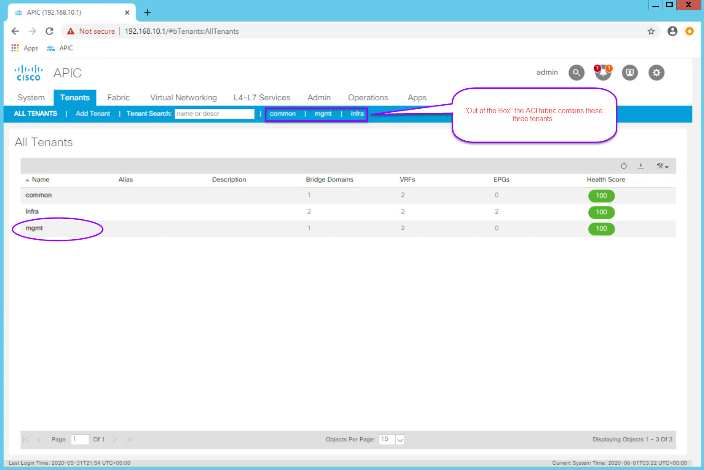

From the **mgmt** Tenant Navigation Pane, from the tenant navigation Pane navigate to **Tenant mgmt > Node Management Addresses > Static Node Management Addresses**

Form here you have two options to get to the configuration dialog for a node management address.
1. Right click on the **Static Node Management Addresses** option in the Navigation Pane
2. Click on the tool icon drop down in the Work Pane.


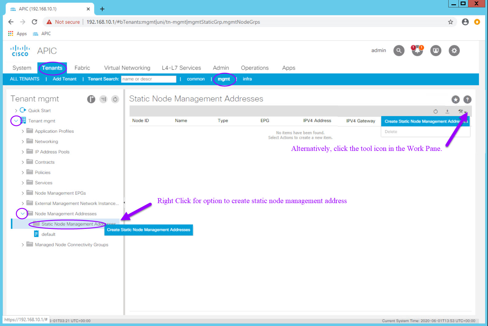

Both of these actions are equivalent and will present you with a dialog to create a static node management address.

In ACI, this is the equivalent of assigning a management IP to the management port of the device.  In ACI you often use the Node ID to identify the device and that is the case here.

You can enter a range, as shown below with a starting IP in the management subnet and generally the IPs will be assigned sequentially.

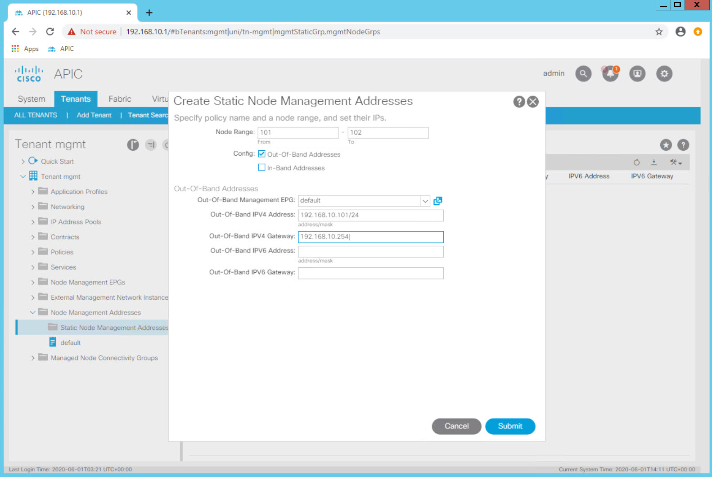

Note: The device hostname, credentials, and other settings are configured on the switch by the APIC when it is first discovered.

While the range option is handy, there may be unintended consequences or if you have an IP addressing convention (Node ID mapped to last octet is a good practice) the assignments many not adhere to your convention.

Its a good practice to do the IP assignment individually on each node.  Note the range from and to values are for a single node.

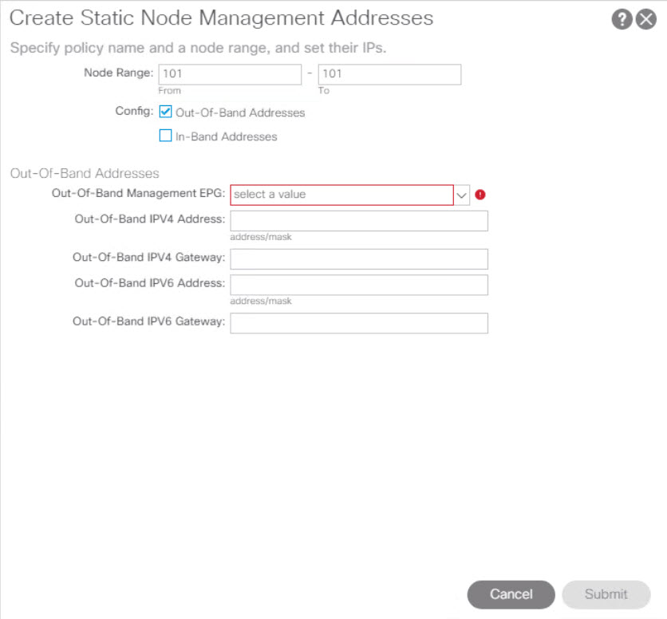

The Lab uses the default OOB (Out of Band) Management EPG, however in a production data center it is a good pracitce to configure and explicit management EPG.

