# Lab 02 - Configure Fabric & Access Constructs

## Context

This lab represents the implementation of networking at the physical layer across the entire fabric as well as on a switch and interface or port level.

Typically in an ACI fabric, the Fabric Policies are configured during initial fabric turn up and then largely left alone.   The Access Policies represetn that "day to day" configuration of the fabric as they define how the fabric connects to hosts and other non-ACI network devices.  You an think of Access Policies as the hardware configuration of interfaces.  The logical portion of the configuration is implemented when Access Policies are associated with EPGs and "Vlans" or Encapsulations.

## Lab Goals

In this lab we will review how to configure basic fabric functionality via *Fabric Policies*. These are configurations steps which are peformed at the fabric level and which have already been configured for the lab but the guide will detail the steps required to complete this step.

We will then look at *Access Policies* which configure the physical (vs logical) aspects of fabric interfaces which connect the leafs (and spines) to compute, storage, appliances, and other non-ACI network devices.

## Fabric Configuration

Configuration in ACI is largely based on policies which abstract the characteristics of traditional network connectivity.  

Consider the diagram below and the steps you normally take to configure a layer 2 trunk interface like the one shows on LEAF-2 e1/11.

In the classical Ethernet environment this configuration is done on LEAF-2 itself so the switch is understood.  The configuration is performed on the interface itself, e1/11 in this case, so that is understood.

Because these objects are abstract and all of the configuration is performed by the APIC controller, each of those "undersood" items are configued discreetly via policy and then put together to achieve the desired functionality.   We will go through that workflow in this lab.

Initially it may seem  like "extra" work to do this but once you start taking advantage of the re-usability of these policy objects and see the ease of scalability, the "extra" work will be well worth it.

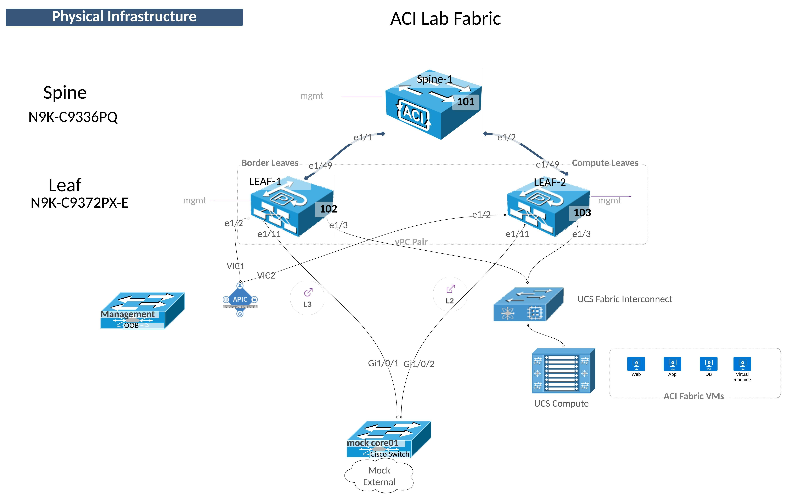

## Implementing Cisco ACI Fabric Connectivity

The Fabric menu has three submenu items.  You should be familiar with the Inventory submenu from Lab 01.

The other two Submenu items configure the fabric itself and the physical connectivity.

Configuring ACI connectivity is generally done in two steps:
1. Configure the Physical Layer Characteristics
2. Configure the Logical Layer Characteristics

### Fabric Policies

Fabric policies control the configuration of the fabric itself.  The most common activity in this section is to define Policy Groups such as the fabrics:

- Data and Time policy (NTP)
- Management Access policy
- SNMP Policy (for the fabric)
- BGP Route Reflector Policy

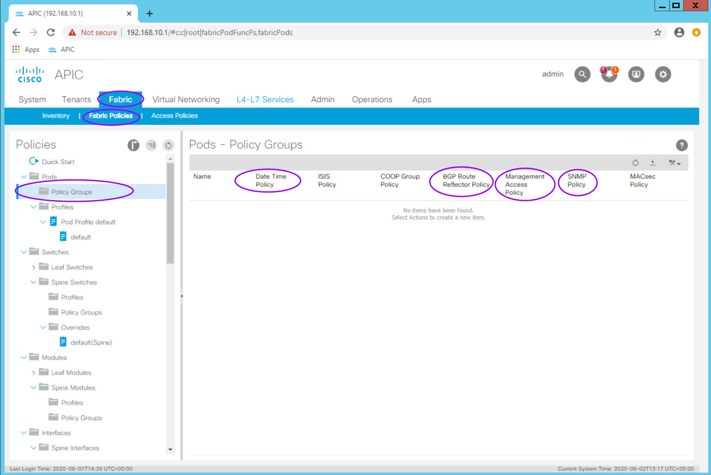

The BGP Route Reflect policy one of the first fabric configuration items which needs to be completed for a functioning fabric.  In a production fabric, it is best practice to make 2 or 4 spines route reflectors.

Note: In recent versions of ACI configuring the route reflectors is done from **System > System Settings > BGP Route Reflector** 

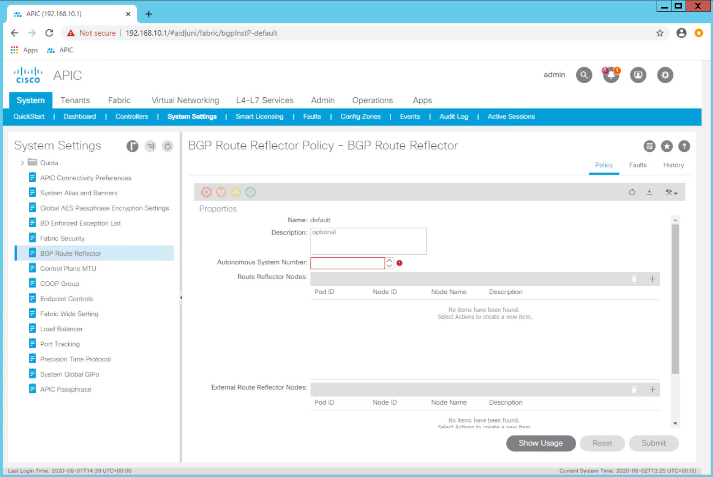

This activity is only done once and the route reflector has already been configured in the the lab for all students.

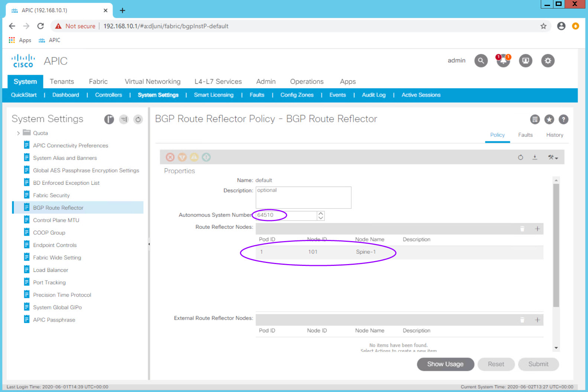

### Access Policies

Unlike the Fabric Policies which are often configured at turn up and then largely left alone, Access Policies are used often to configure new vlans, domains, switches, and interfaces.

Fabric Policies are analogous to configuring two switches in VSS mode or in a vPC domain or VDC.  

Access Policies are analogous to configuring vlans, access or trunk interfaces, and interface settings. 

Access Policies are the "configuration bits" that you will fashion together to obtain the functionality you need for your fabric.

You build Fabric Access Policies with multiple configuration objects:

<table>
<thead>
	<tr>
		<th>Object</th>
		<th>Description &amp; Use</th>
	</tr>
</thead>
<tbody>
	<tr>
		<td>Pool</td>
		<td>Individual or a Range of VLANs</td>
	</tr>
	<tr>
		<td>Physical Domain</td>
		<td>A logical construct tying a vlan pool object to an AAEP</td>
	</tr>
	<tr>
		<td>Attachable Access Entity Profile (AAEP)</td>
		<td>An ACI object which groups physical and virtual domains for scalability.</td>
	</tr>
	<tr>
		<td>Interface Policy</td>
		<td>Describes an individual behavior.&lt;br&gt;For example: CDP enabled, 10Gig Interface, 1Gig Interface</td>
	</tr>
	<tr>
		<td>Interface Policy Group</td>
		<td>Bundles interface policies together for a specific interface behavior and ties that to an AAEP which now adds valid vlans on the interface</td>
	</tr>
	<tr>
		<td>Interface Profile</td>
		<td>Ties an Interface Policy Group to a specific interface number</td>
	</tr>
	<tr>
		<td>Switch Profile</td>
		<td>Defines a fabric switch to which Interface Profiles can be associated</td>
	</tr>
</tbody>
</table>

#### ACI Object (Construct) Relationship Overview

It is vital that you understand the relationship between objects.

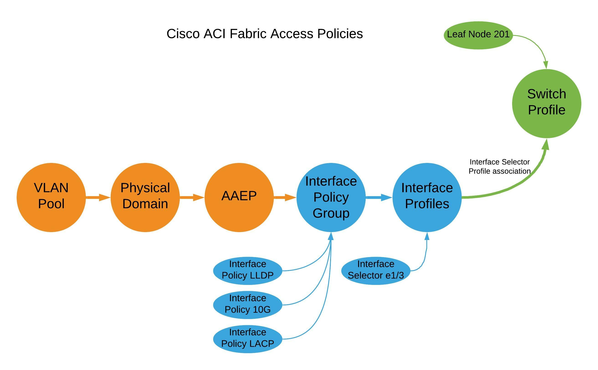

### Tips for naming objects in ACI

A naming standard is critical to sucessful operation of ACI.  It is important to define your naming conventions before configuring anything in ACI.

Objects themselves cannot be renamed.  If you have a typo in an object name it must be deleted and re-created.

Object names are typically up to 64 alphanumeric characters in length (maximum).  

Use underscores (spaces are not allowed)

Keep names short

### Already Configured

As with the Route Reflector configuration, there are other configuration activities which are done ones at the fabric level (rather than the tenant level)

#### vPC Domains in ACI - vPC Protection Groups 

Since one of the first things we are going to do in this lab is configure a port channel (vPC on ACI and a port-channel on switch side), we need to make sure the two leaf switches are configured as a vPC Domain.

This step is done onece for each vPC Domain but we will review the required steps here.  

##### Step 1 - Confirm the two Leaf switches are configured as a vPC Pair

Navigate to **Fabric > Access Policis > Policies > Policies > Switch > VPC Domain**.

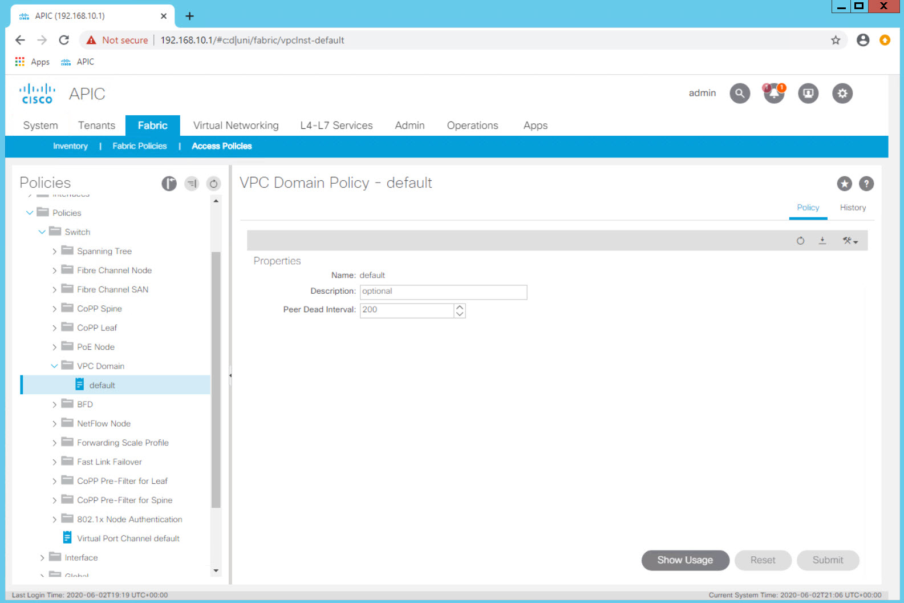

Review the configuration of the **default** vPC domain Dead Peer timer.  Even in a production environment the defaults are rarely changed.  The object name can be misleading as this is *not* where the vPC domain is configured.

Select the **Virtual Port Channel default** object at the top level of **Fabric > Access Policis > Policies > Policies > Switch**

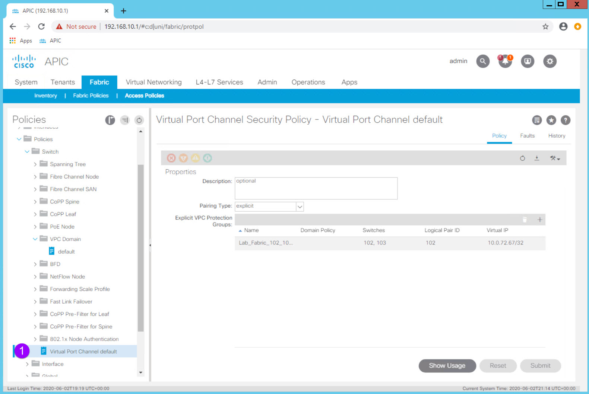

In the Work Pane you can see that the two fabric leaf switches, Node IDs 102 and 103, are configured as a VPC "Protection Group" aka vPC Domain.  The VPC Pair ID is 101 (as a best pracitce use the lowest Node ID number) and the fabric has automatically assigned the the vPC Domain an IP address from the TEP IP address block.

Configuring the vPC Domain is simple once you know where that configuration is done in the GUI.

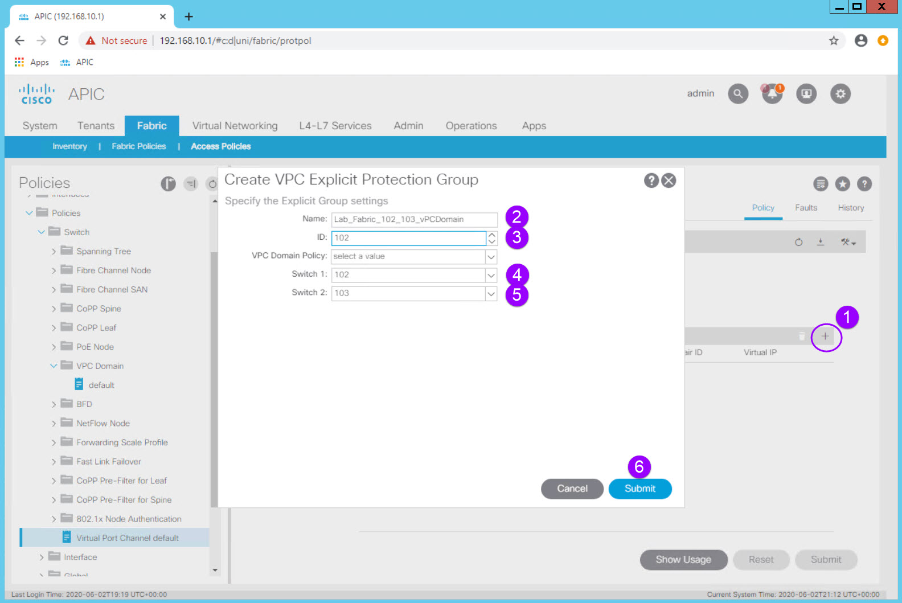

<table>
<thead>
	<tr>
		<th>Configuration Item</th>
		<th>Configuration Name</th>
		<th>Configuration Values</th>
	</tr>
</thead>
<tbody>
	<tr>
		<td>vPC Protection Group (vPC Domain)</td>
		<td>Lab_Fabric_102_103_vPCDomain</td>
		<td>ID: 102 (lowest Node ID by convention) Switch 1: 102  Switch 2: 103</td>
	</tr>
</tbody>
</table>

You would then click **Submit** but remember to not do so in the Lab environment.

In the Lab environment this fabric level configuration is complete and the leaf switches are already operating as a vPC pair.

#### Switch Policies
Defining switch "objects" which can then have policies applied to them is part of the inital fabric configuration and only performed once per switch and switch pair. 

Navigate to **Fabric > Access Policies > Switches > Leaf Switches**.

Notice the options in the Navigation Pane:
- Profiles <-- Leaf Profiles - this is where the switch "objects" are configured
- Policy Groups <-- 
- Overrides

Navigate to **Fabric > Access Policies > Switches > Leaf Switches > Profiles** and expand the Profiles option.

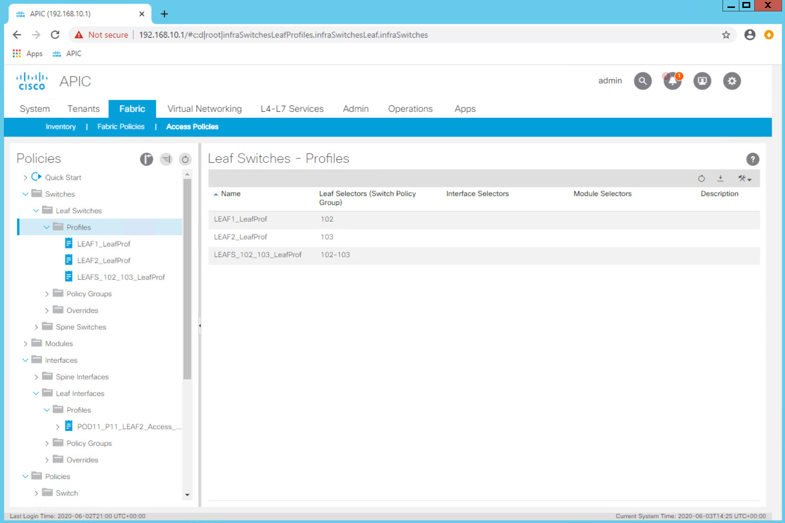

You will see three switch "objects" representing
- LEAF-1
- LEAF-2
- LEAF-1 and LEAF-2 Pair

When you want to configure a single interface on a specific leaf you will use the specific individual switch object.

In our first example, we will configure a single access port on LEAF-2.

Since the switches are abstracted, it is also possible to define an object that represents both switches.  When configuring a vPC or two access ports using the same port on each specific switch, this pair object can be used. 

In our second example we will associate the same port, e1/11, to the LEAFS_102_103_LeafProf Leaf Profile.  In one step or associate we have configured port e1/11 on both switches.  In this exercise port e1/11 will be configured as a vPC.

## Configuring Interface Policies and Profiles

Keeping in mind the full connectivity workflow of:

1. Configure the Physical Layer Characteristics <-- You are here
2. Configure the Logical Layer Characteristics

Log in to your Student PC, open your browser, and access the APIC GUI.

##### Step 1 - Creating Interface Policies - CDP Enabled

Navigate to **Fabric > Access Policies > Policies > Interface > CDP Interface**

Expand **CDP Interface** and note that there is a default policy that comes pre configured.  This is the case with many objects and while the controller will use these default policies when needed and an explicit policy is not selected, it is a best practice to explicitly configure policies for the behavior you want.

Create an explicit policy which enables CDP. 

**Right Click** on **CDP Interface** and select the **Create CDP Interface Policy** option.

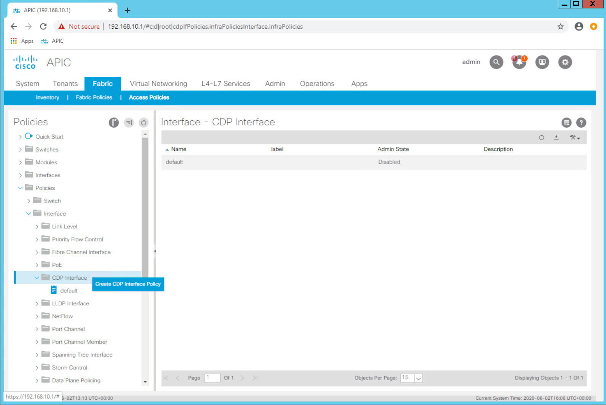

<table>
<thead>
	<tr>
		<th>Configuration Item</th>
		<th>Configuration Name</th>
		<th>Configuration Values</th>
	</tr>
</thead>
<tbody>
	<tr>
		<td>Interface Policy to enable CDP</td>
		<td>POD##_CDP_Enabled Example: POD11_CDP_Enabled (for POD11 Student)</td>
		<td>Admin State = Enabled</td>
	</tr>
</tbody>
</table>

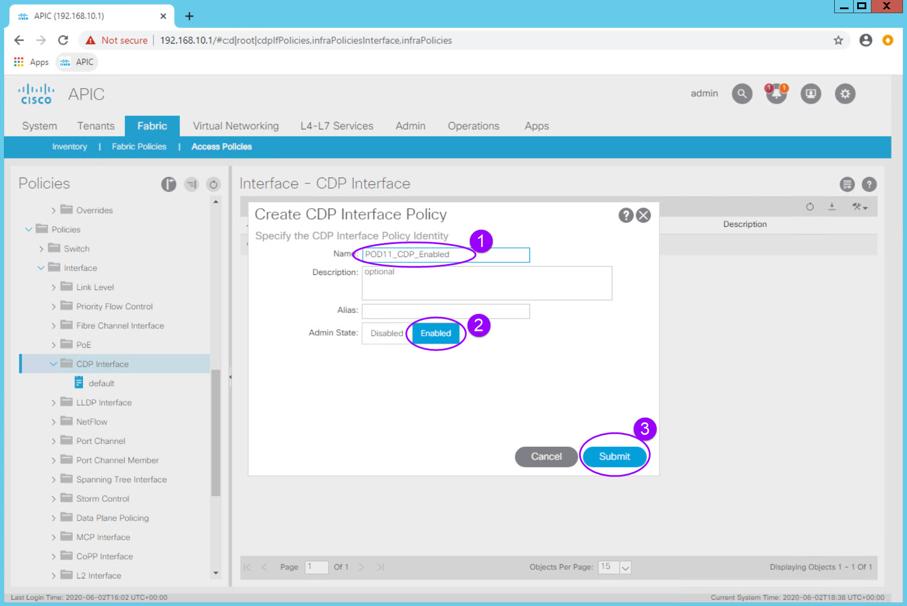

You now have a policy to enable CDP on an interface which can be reused.

Note that in ACI the preferred discovery protocol is LLDP. That is enabled by default across the fabric and is a key part of the discovery process.  CDP is not enabled on the fabric by default after 4.0.  In order to enable CDP on an interface you will use this new just created policy.

##### Step 2 - Creating Interface Policies - Interface Speed

Navigate to **Fabric > Access Policies > Policies > Interface > Link Level**

**Right Click** on **Link Level** and select the **Create Link Level Policy** option.

<table>
<thead>
	<tr>
		<th>Configuration Item</th>
		<th>Configuration Name</th>
		<th>Configuration Values</th>
	</tr>
</thead>
<tbody>
	<tr>
		<td>Interface Policy to configure a 1 GigE Interface</td>
		<td>POD##_1G_IntPol Example: POD11_1G_IntPol (for POD11 Student)</td>
		<td>Speed: 1 Gbps</td>
	</tr>
	<tr>
		<td>Interface Policy to configure a 10 GigE Interface</td>
		<td>POD##_10G_IntPol Example: POD11_10G_IntPol (for POD11 Student)</td>
		<td>Speed: 10 Gbps</td>
	</tr>
</tbody>
</table>

##### Step 3 - Creating Interface Policies - LLDP Disable

Navigate to **Fabric > Access Policies > Policies > Interface > LLDP Interface**

<table>
<thead>
	<tr>
		<th>Configuration Item</th>
		<th>Configuration Name</th>
		<th>Configuration Values</th>
	</tr>
</thead>
<tbody>
	<tr>
		<td>Interface Policy to disable LLDP</td>
		<td>POD##_LLDP_Disabled Example: POD11_LLDP_Disabled</td>
		<td>Recieve State = Disabled Transmit State = Disabled</td>
	</tr>
</tbody>
</table>

##### Step 4 - Creating Interface Policies - Static Port Channel

Navigate to **Fabric > Access Policies > Policies > Interface > Port Channel**

<table>
<thead>
	<tr>
		<th>Configuration Item</th>
		<th>Configuration Name</th>
		<th>Configuration Values</th>
	</tr>
</thead>
<tbody>
	<tr>
		<td>Interface Policy for a static port channel</td>
		<td>POD##_Static_Po Example: POD11_Static_Po</td>
		<td>Mode: Static Channel - Mode On</td>
	</tr>
	<tr>
		<td>Interface Policy for an active LACP port channel</td>
		<td>POD##_LACP_Active_Po Example: POD11_LACP_Active_Po</td>
		<td>Mode: LACP Active</td>
	</tr>	
</tbody>
</table>

##### Step 5 - Creating Interface Policy Groups - Access Interface

Lets take these individual behaviors defined in each **Interface Policy** and bundle them into a group of behaviors that can then be associated with an interface.  This bundle of configuration items defining the port behavior is called an **Interface Policy Group**.

Lets define the Policy Group that would define a 1Gig interface with CDP enabled, LLD disabled, and a static port channel.

##### Step 6 - Creating Interface Policy Groups - Access Interface

##### Check in

With these policies, we have now defined "reusable behaviors":

- 1 Gigabit Ethernet Interface 
- Enable CDP
- Disable LLDP
- Static Port Channel
- Active LAC Port Channel

We have also defined two 

It important to note that these "behaviors" are not associated with an interface or even a switch at this point. Think of them as "raw ingredients" that are ready for use in order to implement a specific functionality.

We will then configure a 1Gig LACP port channel down to the "mock-core01" switch.

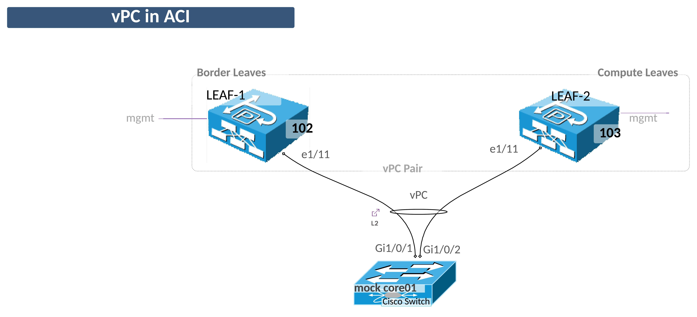

