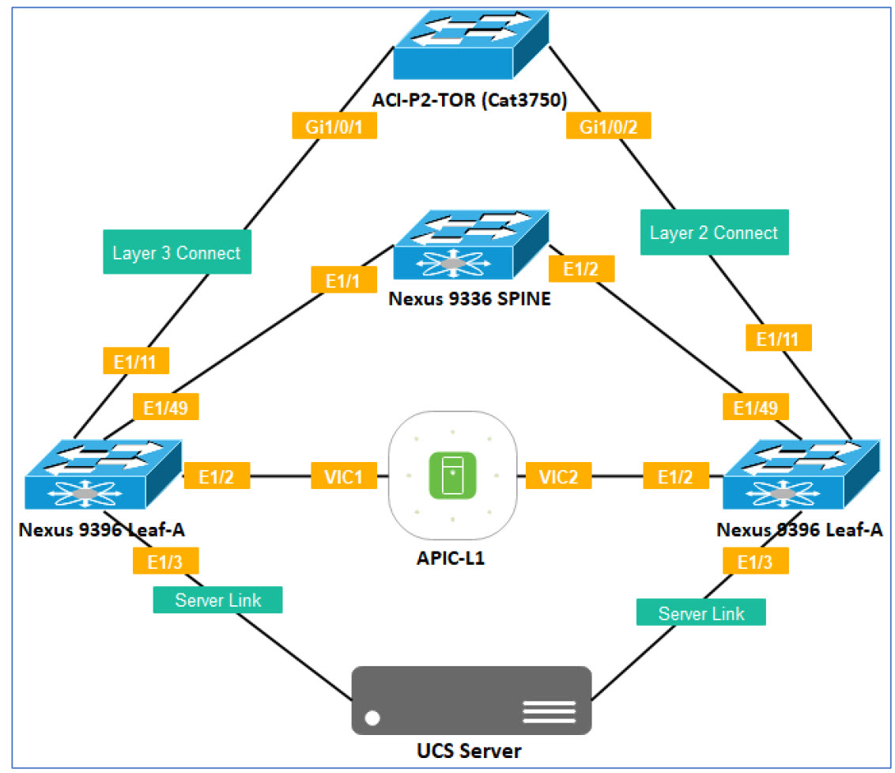

# Getting Around the Lab

How this lab works and things to keep in mind...

## Lab Access

Each student is assigned their own lab "Pod" (Tenant) in the fabric.

Please refer to the Student Pod Table below for your Remote Desktop (RDP) IP Address and Credentials.

Access to the lab environment is via the Remote Desktop Protocol (RDP) and so you will need an RDP client on your system in order to access the lab.

#### Student Pod Table

<table>
<thead>
	<tr>
		<th>POD Number</th>
		<th>RDP IP</th>
		<th>RDP Port</th>
		<th>Username</th>
		<th>Password</th>
	</tr>
</thead>
<tbody>
	<tr>
		<td>11</td>
		<td>65.49.10.72</td>
		<td><b>7779</b></td>
		<td>Claudia</td>
		<td>1234QWer!</td>
	</tr>
</tbody>
</table>

##### Step 1 - RDP Access to Student PC

Login with your credentials from the Student Pod Table

<table>
<thead>
	<tr>
		<th>Operating System</th>
		<th>Details</th>
	</tr>
</thead>
<tbody>
	<tr>
		<td>Windows 10</td>
		<td>From the Search box Type run and &lt;Enter&gt; In the Run dialog type mstsc /admin &lt;Enter&gt;</td>
	</tr>
	<tr>
		<td>Macintosh</td>
		<td><a href="https://apps.apple.com/us/app/microsoft-remote-desktop/id1295203466?mt=12E">Microsoft Remote Desktop client on the Mac App Store</a>  See <a href="ttps://docs.microsoft.com/en-us/windows-server/remote/remote-desktop-services/clients/remote-desktop-mac">Microsoft Get started with the macOS client</a></td>
	</tr>
</tbody>
</table>

Tip: If you are behind a corporate firewall you may want to use **Web RDP**

Web RDP Details:

https://65.49.89.250/#/

<table>
<thead>
	<tr>
		<th>POD Number</th>
		<th>Username</th>
		<th>Password</th>
	</tr>
</thead>
<tbody>
	<tr>
		<td>11</td>
		<td>ACI-POD11</td>
		<td>$VGi@IQezt1</td>
	</tr>
</tbody>
</table>

##### Step 2 - Applications
 
Once you sucesfully log in (Tip: Don't forget the RDP port number) you will see a customized Desktop which will have all the tools you need and from where you can access all the devices.

- Chrome
- Putty
- This lab guide is also available on the Desktop.

## IMPORTANT:  Please review before continuing with the lab.
### LAB PREMISE

This Lab has a total of 16 Pods.  Some equipment is shared across all the Pods while other equipment is dedicated to each individual Pod.   A Pod is a group of devices and resources which make an individual Lab usable for each student.  Each Pod is identified by a two digit number.  Throghout your lab guide, if you see ##, replace ## with your Pod number.

ACI is fundamentally a multi-tenant environment and the lab environment makes full use of that capability.  

Each Student will create their own Tenant in their Pod and map all the policies, test servers, and equipment dedicated to the Pod to their own tenant.

For example:  The student assigned to POD11 will create their own POD11 tenant and configure access policies and virtual networking policies to the POD11 tenant.

A naming standard is particularly important in an ACI Design.  All policies will follow a naming standard based on your POD number. 

### Common Equipment

The table below details the shared equipment in the lab.  This equipment will be shared by all students.

Because these resources are shared, you will see configuration appear that is not your own.  Please do not delete or change any configuration item that is not your own. Please be respectful of the other students and use only your POD resources.

Table of Common (Shared) Devices and Access Information

<table>
<thead>
	<tr>
		<th>Device</th>
		<th>Management/Terminal Server IP</th>
		<th>Telnet Port Number</th>
		<th>Credentials</th>
	</tr>
</thead>
<tbody>
	<tr>
		<td>APIC (apic.dc.local)</td>
		<td>192.168.10.1</td>
		<td></td>
		<td>admin/1234QWer</td>
	</tr>
	<tr>
		<td>spine</td>
		<td>192.168.250.202</td>
		<td>7006</td>
		<td>admin/1234QWer</td>
	</tr>
	<tr>
		<td>leaf-1</td>
		<td>192.168.250.202</td>
		<td>7007</td>
		<td>admin/1234QWer</td>
	</tr>
	<tr>
		<td>leaf-2</td>
		<td>192.168.250.202</td>
		<td>7008</td>
		<td>admin/1234QWer</td>
	</tr>
	<tr>
		<td>L2/L3 Switch</td>
		<td>192.168.250.202</td>
		<td>7009</td>
		<td>admin/1234QWer</td>
	</tr>
	<tr>
		<td>AD/DNS/FTP Server</td>
		<td>192.168.10.40</td>
		<td></td>
		<td>admin/1234QWer</td>
	</tr>
	<tr>
		<td>NTP Server</td>
		<td>192.168.10.40</td>
		<td></td>
		<td></td>
	</tr>
</tbody>
</table>

### Dedicated Equipment

This equipment is dedicated to every individual student.

Each Student Pod has a dedicated ESXi Host, vCenter and a set of Linux based Virtual Machines.

POD11 Equipment

<table>
<thead>
	<tr>
		<th>Device</th>
		<th>Management IP</th>
		<th>Fabric IP/ FQDN</th>
		<th>Username</th>
		<th>Password</th>
	</tr>
</thead>
<tbody>
	<tr>
		<td>Linux VMs</td>
		<td></td>
		<td></td>
		<td></td>
		<td></td>
	</tr>
	<tr>
		<td>WEB</td>
		<td></td>
		<td>10.0.1.1/24</td>
		<td>Root</td>
		<td>1234Qwer</td>
	</tr>
	<tr>
		<td>APP</td>
		<td></td>
		<td>10.0.2.1/24</td>
		<td>Roo</td>
		<td>1234Qwer</td>
	</tr>
	<tr>
		<td>DB</td>
		<td></td>
		<td>10.0.3.1/24</td>
		<td>Root</td>
		<td>1234Qwer</td>
	</tr>
	<tr>
		<td>TRANSACT</td>
		<td></td>
		<td>10.0.4.1/24</td>
		<td>Root</td>
		<td>1234Qwer</td>
	</tr>
	<tr>
		<td>Virtualization Environment</td>
		<td></td>
		<td></td>
		<td></td>
		<td></td>
	</tr>
	<tr>
		<td>ESXi Host</td>
		<td>192.168.10.211</td>
		<td>ESXp11@dc.local</td>
		<td>Root</td>
		<td>1234QWer</td>
	</tr>
	<tr>
		<td>vCenter</td>
		<td>192.168.10.212</td>
		<td>vcenterpod16.dc.local</td>
		<td>administrator@vsphere.local</td>
		<td>1234QWer!</td>
	</tr>
</tbody>
</table>

### Credentials Summary

For ease of use, the Lab has minimized the number of credentials and uses a standard pattern for the password with minor variations.   The table below summarizes all the credentilas you will need to access all the lab resources.

<table>
<thead>
	<tr>
		<th>Device Type</th>
		<th>Username/Password</th>
	</tr>
</thead>
<tbody>
	<tr>
		<td>Network Devices (Including APIC)</td>
		<td>admin/1234QWer</td>
	</tr>
	<tr>
		<td>Linux Virtual Machines</td>
		<td>Root/1234Qwer</td>
	</tr>
	<tr>
		<td>ESXi Host</td>
		<td>Root/1234QWer</td>
	</tr>
	<tr>
		<td>vCenter</td>
		<td>administrator@vsphere.local/1234QWer!</td>
	</tr>
</tbody>
</table>

### Physical Interface Reference

ACI is fundamentally a networking technology and so throughout the labs you will need to configure interfaces. 

Use the Physical Interface Table below as a reference.

#### SPINE-1

<table>
<thead>
	<tr>
		<th>POD#</th>
		<th>PORT</th>
		<th>Connected To Device</th>
		<th>Connected to Device Port</th>
	</tr>
</thead>
<tbody>
	<tr>
		<td>ALL PODS</td>
		<td>e1/1</td>
		<td>leaf-1</td>
		<td>e1/49</td>
	</tr>
	<tr>
		<td>ALL PODS</td>
		<td>e1/2</td>
		<td>leaf-2</td>
		<td>e1/49</td>
	</tr>
</tbody>
</table>

#### LEAF-1

<table>
<thead>
	<tr>
		<th>POD#</th>
		<th>PORT</th>
		<th>Connected To Device</th>
		<th>Connected to Device Port</th>
	</tr>
</thead>
<tbody>
	<tr>
		<td>ALL PODS</td>
		<td>e1/2</td>
		<td>APIC</td>
		<td>VIC1</td>
	</tr>
	<tr>
		<td>POD11</td>
		<td>e1/3</td>
		<td>UCS-SERVER-P11</td>
		<td>VIC1</td>
	</tr>
	<tr>
		<td>POD11</td>
		<td>e1/11</td>
		<td>ACI-P2-TOR (Cat 3750)</td>
		<td>Gi1/0/1</td>
	</tr>
	<tr>
		<td>ALL PODS</td>
		<td>e1/49</td>
		<td>SPINE-1</td>
		<td>e1/1</td>
	</tr>
</tbody>
</table>

#### LEAF-2

<table>
<thead>
	<tr>
		<th>POD#</th>
		<th>PORT</th>
		<th>Connected To Device</th>
		<th>Connected to Device Port</th>
	</tr>
</thead>
<tbody>
	<tr>
		<td>ALL PODS</td>
		<td>e1/2</td>
		<td>APIC</td>
		<td>VIC2</td>
	</tr>
	<tr>
		<td>POD11</td>
		<td>e1/3</td>
		<td>UCS-SERVER-P11</td>
		<td>VIC2</td>
	</tr>
	<tr>
		<td>POD11</td>
		<td>e1/11</td>
		<td>ACI-P2-TOR (Cat 3750)</td>
		<td>Gi1/0/2</td>
	</tr>
	<tr>
		<td>ALL PODS</td>
		<td>e1/49</td>
		<td>SPINE-1</td>
		<td>e1/2</td>
	</tr>
</tbody>
</table>

### Layer 2 and Layer 3 Logical Configuration

#### L3Out IP and Vlan Details

<table>
<thead>
	<tr>
		<th>POD Number</th>
		<th>OSPF AREA</th>
		<th>LEAF-1 Interface</th>
		<th>OSPF VLAN</th>
		<th>SVI on Layer 3 Switch</th>
		<th>SVI on APIC</th>
		<th>VLAN Pool Start</th>
		<th>VLAN Pool End</th>
	</tr>
</thead>
<tbody>
	<tr>
		<td>POD11</td>
		<td>11</td>
		<td>e1/11</td>
		<td>1112</td>
		<td>172.16.11.2/30</td>
		<td>172.16.11.1/30</td>
		<td>1110</td>
		<td>1119</td>
	</tr>
</tbody>
</table>

#### Layer 2 Details

<table>
<thead>
	<tr>
		<th>POD Number</th>
		<th>SVI on External Layer 3 Device</th>
		<th>LEAF-2 Interface</th>
		<th>Layer 2 VLANS</th>
		<th>VLAN Pool Start</th>
		<th>VLAN Pool End</th>
	</tr>
</thead>
<tbody>
	<tr>
		<td>POD11</td>
		<td>10.0.2.99</td>
		<td>e1/11</td>
		<td>112</td>
		<td>110</td>
		<td>119</td>
	</tr>
</tbody>
</table>

#### ASA Management Details

<table>
<thead>
	<tr>
		<th>POD Number</th>
		<th>ASA Management IP</th>
	</tr>
</thead>
<tbody>
	<tr>
		<td>POD11</td>
		<td>192.168.10.71</td>
	</tr>
</tbody>
</table>

## Lets get started with ACI!
