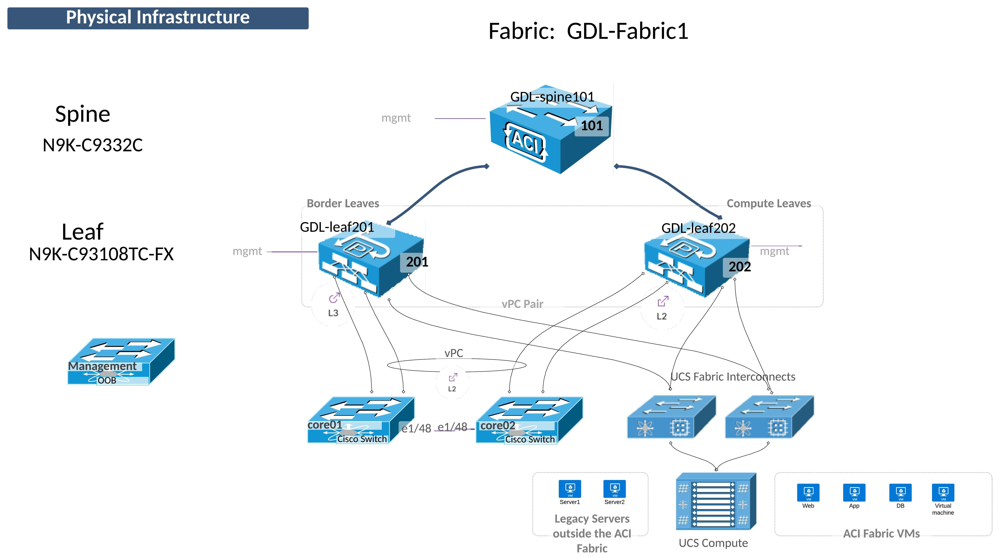

## Lab Topology
The lab topology is designed to allow configuration of the most common scenarios.

Once the Fabric has been discovered and configured and the Tenant design applied, the following functionality can be configured:

- Layer 3 Routing
- Layer 2 Connectivity to a Legacy Network
- Layer 2 Virtual Port Channel

