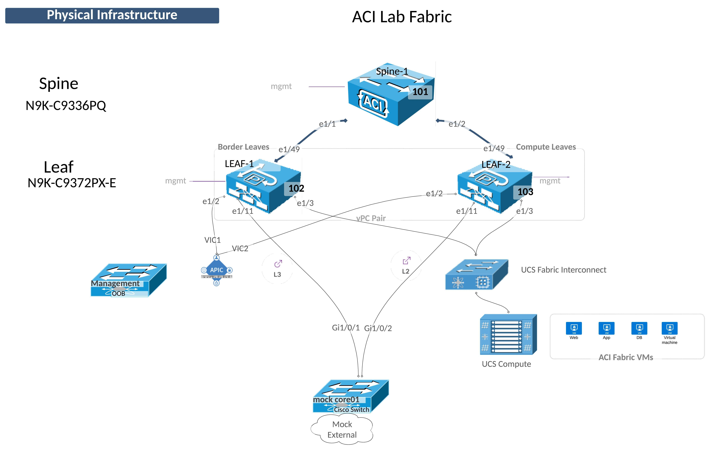

## Lab Topology
The lab topology is designed to allow configuration of the most common scenarios.

Once the Fabric has been discovered and configured and the Tenant design applied, the following functionality can be configured:

- Layer 3 Routing
- Layer 2 Connectivity to a Legacy Network
- Layer 2 Virtual Port Channel

A note about Border Leafs.   This designation is common in an ACI fabric along with "Compute Leafs" and even "Storage Leafs".  It important to know that this designation is merely an convention to identify the leaf pair that hosts all external connectivity external to the fabric (Border Leafs) or to identify the leaf pairs that are used for host connectivity (Compute Leafs). 

